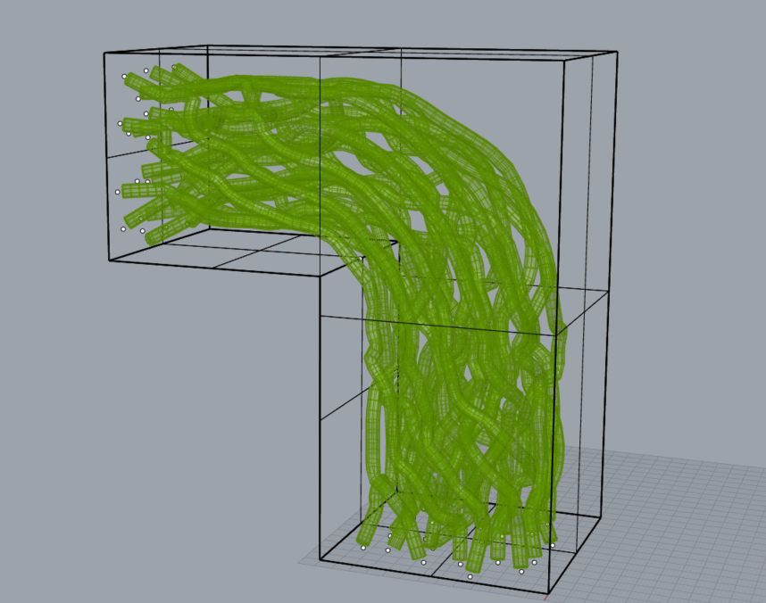
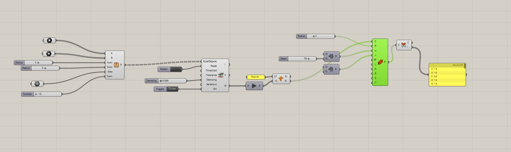
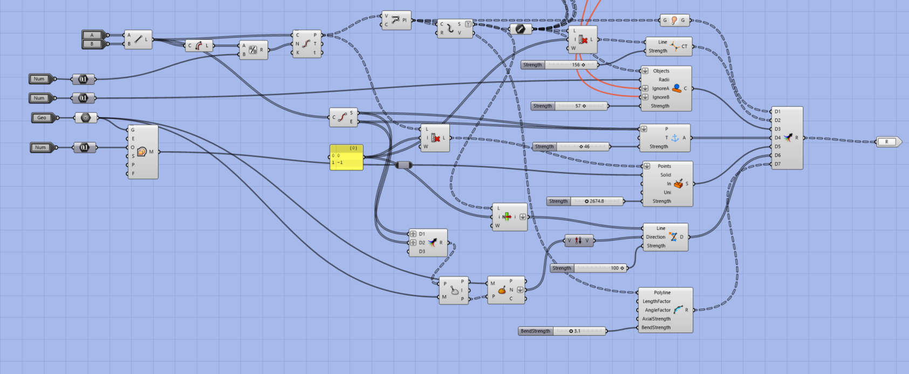

# 3D Grasshopper Router

This is my attempt at creating a 3D auto-router using Grasshopper 3D and the Kangaroo Plugin. Using  Kangaroo allows you to apply goals to your geometry the the solver is able to resolve forces

This is the example internalized geometry with points on different faces that are matched up and the solver tries to create lines between them

The Each line defines a pipe that avoids going though any other pipes.

The definition uses different goals components:
- Constant tension to try to minimize the length 
between the start and end points 
- Collider to maintain a minimum distance between different paths
- Anchor to keep the start and end points from moving
- Solid to keep the points within the shape
- Rod to sop the shape from being to bendy
